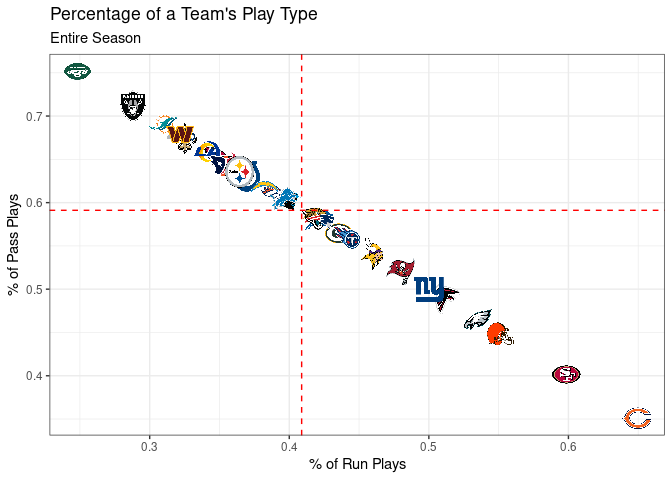
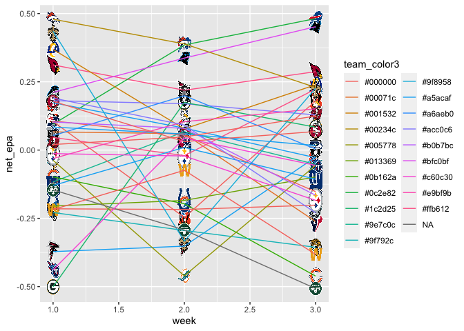

NFL\_Report
================
Sam Worley
9/23/2021

## NFL Week 3

## Efficiency Landscape

``` r
library(ggimage)
pbp <-  pbp %>%
  dplyr::filter(season_type == "REG") %>%
  dplyr::filter(!is.na(posteam) & (rush == 1 | pass == 1))
offense <- pbp %>%
  dplyr::group_by(posteam) %>%
  dplyr::summarise(off_epa = mean(epa, na.rm = TRUE))
defense <- pbp %>%
  dplyr::group_by(defteam) %>%
  dplyr::summarise(def_epa = mean(epa, na.rm = TRUE))
logos <- teams_colors_logos %>% dplyr::select(team_abbr, team_logo_espn)
joined <- offense %>%
  dplyr::inner_join(defense, by = c("posteam" = "defteam")) %>%
  dplyr::inner_join(logos, by = c("posteam" = "team_abbr")) %>%
  dplyr::inner_join(teams_colors_logos, by = c("posteam" = "team_abbr"))

joined %>%
  ggplot2::ggplot(aes(x = off_epa, y = def_epa)) +
  ggplot2::geom_abline(slope = -1.5, intercept = c(.4, .3, .2, .1, 0, -.1, -.2, -.3), alpha = .2) +
  ggplot2::geom_hline(aes(yintercept = mean(off_epa)), color = "red", linetype = "dashed") +
  ggplot2::geom_vline(aes(xintercept = mean(def_epa)), color = "red", linetype = "dashed") +
  ggimage::geom_image(aes(image = team_logo_espn.x), size = 0.05, asp = 16 / 9) +
  ggplot2::labs(
    x = "Offense EPA/play",
    y = "Defense EPA/play",
    caption = "Data: @nflfastR",
    title = "NFL Offensive and Defensive EPA per Play"
  ) +
  ggplot2::theme_bw() +
  ggplot2::theme(
    aspect.ratio = 9 / 16,
    plot.title = ggplot2::element_text(size = 12, hjust = 0.5, face = "bold")
  ) +
  ggplot2::scale_y_reverse()
```

<!-- -->

``` r
weekly_offense <- pbp %>%
  group_by(posteam, week) %>%
  summarise(
    off_epa = mean(epa, na.rm = TRUE)
  )
```

    ## `summarise()` has grouped output by 'posteam'. You can override using the `.groups` argument.

``` r
weekly_defense <- pbp %>%
  group_by(defteam, week) %>%
  summarise(
    def_epa = mean(epa, na.rm = TRUE)
  )
```

    ## `summarise()` has grouped output by 'defteam'. You can override using the `.groups` argument.

``` r
weekly_epa <- weekly_offense %>%
  dplyr::inner_join(defense, by = c("posteam" = "defteam")) %>%
  dplyr::inner_join(logos, by = c("posteam" = "team_abbr")) %>%
  dplyr::inner_join(teams_colors_logos, by = c("posteam" = "team_abbr"))

#head(weekly_epa)

weekly_epa <- weekly_epa %>%
  mutate(
    net_epa = off_epa - def_epa
  )

weekly_epa %>%
  ggplot(aes(x = week, y = net_epa)) +
  ggimage::geom_image(aes(image = team_logo_espn.x), size = 0.05, asp = 16 / 9) + 
  geom_line(aes(group = posteam, color = team_color3))
```

<!-- -->

Ideas: 1. Team Defense: 2x2 Matrix against the run vs pass 2. Team
Offense: 2x2 Matrix using pass vs the run

Questions: \* Who is the strongest running team? Runs the most? \* Who
is the strongest passing team? Passes the most?

test line
