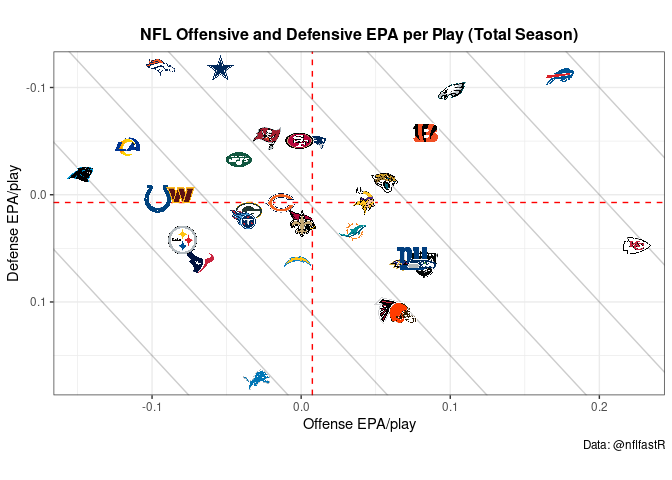
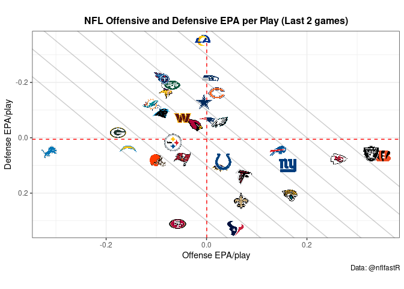
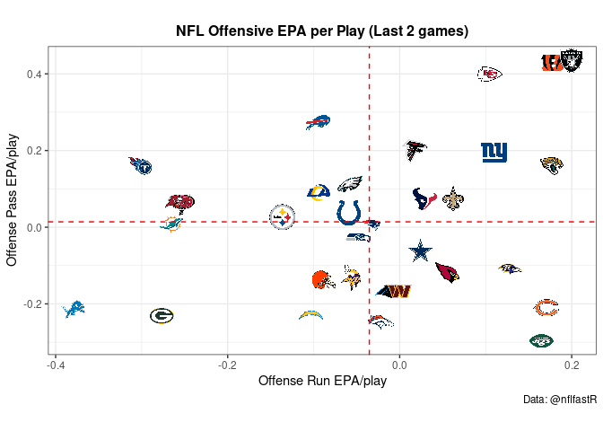
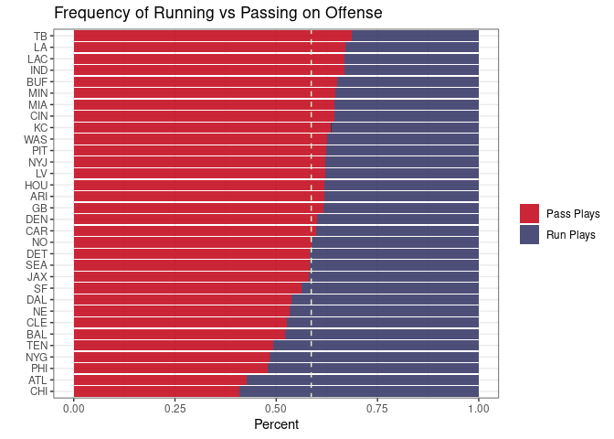
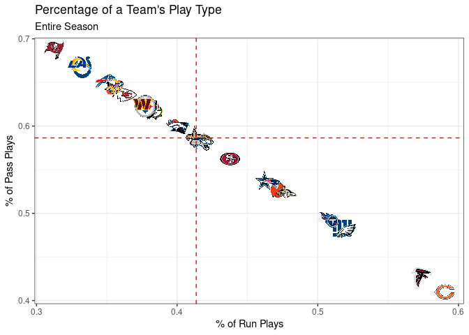
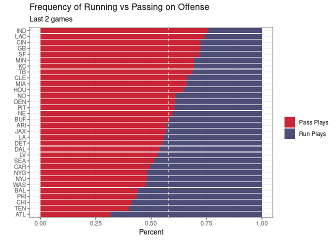
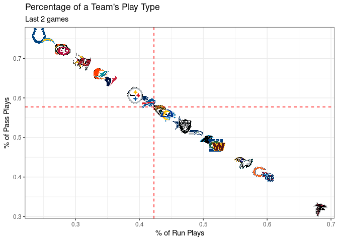
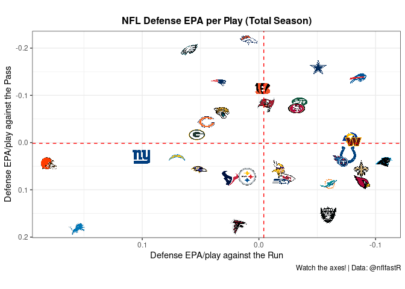
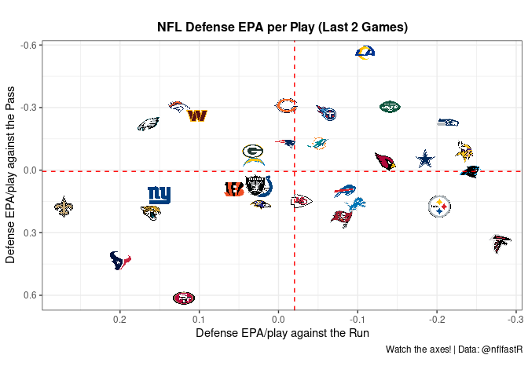

# NFL Landscape: Week 10

### Overall Efficiency Landscape

The code for this graph (and data for the whole report) comes directly
from the good people at [nflfastR](https://www.nflfastr.com/index.html)
straight off their [getting started
page](https://www.nflfastr.com/articles/nflfastR.html#example-5-plot-offensive-and-defensive-epa-per-play-for-a-given-season),
and for that, I thank them.

This graph looks at the offense vs defense epa for the current season as
a whole, for every game.
<!-- -->

But how is a team trending? Let’s look at the same plot of offense &
defense efficiency the last two games only.

<!-- -->

## Offense and Defensive Breakdowns

Where are these efficiency metrics coming from and what drives them?
Well, we can break offense and defense into how they compare when the
play type is a run, and when it is a pass.

### Offense Breakdown: Run vs Pass

Starting with offense and the average EPA gained per play when they
throw versus run the ball.

<!-- -->

Again, this graph has the averages looking at the whole season, what
happens when we look at the last three games?

<!-- -->

<!-- -->

<!-- -->

Recent Distribution of Running vs Passing

<!-- -->

<!-- -->

### Defensive Breakdowns: Run vs Pass

Let’s do the same thing but looking at how a team’s defense fairs
against an opposing offense running pass or rush plays.

<!-- -->

<!-- -->
